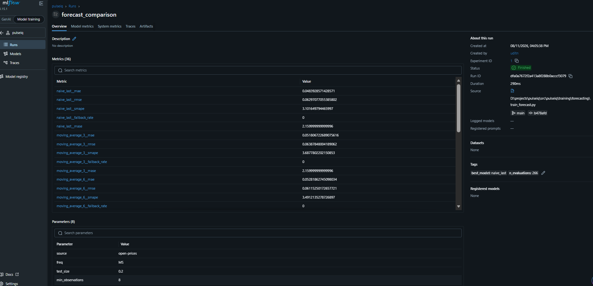

# Metrics

Measured results only. Nothing here is estimated, projected, or copied from a
tutorial. Every number is reproducible with the command shown above it.


*Runs tracked in MLflow (SQLite backend), each pinned to the git commit that
produced it. Artifacts — leaderboard, per-series results, summary JSON — are
stored with the run.*
---

## Forecasting — price prediction

**Task.** Predict the price of a product at a given shop, from its own price
history. Series identity is `barcode@location_id`.

**Data.** Open Prices (Open Food Facts), ODbL. 287,749 rows in the export,
222,457 after filtering to EUR.

**Protocol.**
- Irregular observations (median gap 17 days) resampled to a **monthly grid**,
  median per bucket, forward-fill capped at 3 periods.
- **Strictly chronological, per-product** train/test split; verified by
  `Split.assert_no_leakage()` on every run.
- **Imputed rows excluded from scoring.** Forward-filled points are copies of
  their predecessor, so scoring on them rewards whichever model changes its
  prediction least.
- Metrics are the **median across series**, not the mean — prices span €1.50 to
  €30, and a mean would rank models by whichever handled one expensive product
  best.

---

### Run A — 38 series

```
python -m pulseiq.training.forecasting.train_forecast \
    --source open-prices --max-series 40 --no-prophet
```

Grid: 1,873 points · 38 series · 70.3% observed · median 44 points/series ·
2017-02 → 2026-08 · train 1,421 / test 452 · 266 evaluations in 7.1s

| model | MAE | RMSE | sMAPE | MASE | fallback |
|---|---|---|---|---|---|
| **naive_last** | **0.0484** | 0.0630 | 3.10% | 2.160 | 0% |
| moving_average_3 | 0.0518 | 0.0639 | 3.69% | 2.160 | 0% |
| moving_average_6 | 0.0528 | 0.0612 | 3.49% | 2.989 | 0% |
| arima_auto | 0.0640 | 0.0820 | 4.29% | 2.993 | 0% |
| drift | 0.0784 | 0.0931 | 5.32% | 4.583 | 0% |
| seasonal_naive_12 | 0.0824 | 0.1024 | 6.07% | 5.562 | 0% |
| mean | 0.2108 | 0.2204 | 10.75% | 10.974 | 0% |

---

### Run B — 96 series, including Prophet

```
python -m pulseiq.training.forecasting.train_forecast \
    --source open-prices --max-series 100
```

Grid: 3,756 points · 97 series · 69.7% observed · median 36 points/series ·
2010-07 → 2026-08 · train 2,799 / test 949 · 768 evaluations in 138.4s

| model | MAE | RMSE | sMAPE | MASE | fallback |
|---|---|---|---|---|---|
| **naive_last** | **0.0551** | 0.0649 | 3.35% | 2.068 | 0% |
| moving_average_6 | 0.0618 | 0.0779 | 3.77% | 2.468 | 0% |
| moving_average_3 | 0.0630 | 0.0804 | 3.69% | 2.073 | 0% |
| arima_auto | 0.0730 | 0.0862 | 3.87% | 2.629 | 0% |
| drift | 0.1115 | 0.1188 | 5.32% | 3.828 | 0% |
| seasonal_naive_12 | 0.1137 | 0.1266 | 6.24% | 4.390 | 0% |
| prophet | 0.1742 | 0.2128 | 7.46% | 6.337 | 0% |
| mean | 0.1831 | 0.1962 | 9.05% | 6.054 | 0% |

**Fallback rate is 0% for every model**, so no result here is a silently
degraded naive forecast wearing another model's name.

---

## Headline finding

**No model beat the naive baseline.** Best MAE €0.055, sMAPE 3.35%, achieved by
predicting "next month costs what this month costs".

This is reported as the result rather than buried, because it is very probably
the *correct* result:

1. **For a random walk, the naive forecast is optimal.** Retail prices are close
   to one — flat for months, then a step change. A model beating naive by a wide
   margin on this data would be evidence of leakage, not skill.
2. **The evaluation horizon is long.** `test_size=0.2` on series spanning
   2010–2026 means forecasting roughly three years ahead on a monthly grid — a
   ~36-step horizon. No method beats naive that far out.
3. **Ordering is sensible.** Simple methods (naive, short moving averages) beat
   complex ones (Prophet, seasonal naive) on short, noisy, level-shifting
   series. Prophet's yearly seasonality has little to fit when the median series
   is 36 months long, and fitting it costs accuracy.

MASE is ~2.1 for the best model: a multi-step forecast is roughly twice as hard
as the one-step-ahead naive benchmark, which is expected and not a defect.

---

## Known limitation of this evaluation

The horizon above answers *"what will this cost in three years?"* The useful
business question is *"what will this cost next month?"*

Model advantage in forecasting is **horizon-dependent**, and a single long
horizon can only show that everything converges to naive. The next run should
use `rolling_origin_splits()` at h = 1, 3 and 6 and report a MAE-versus-horizon
curve. That is where ARIMA and Prophet have a chance to earn their place, and it
is the standard way forecasting results are reported.

Until that runs, the honest claim is: **at a long horizon, no method beats the
naive baseline on this data.**

---

## Discount classification — not yet run

The Open Prices ground-truth discount label (`price_is_discounted`) has a
**1.9% positive rate** in the export. That is too sparse for regression: a model
predicting zero everywhere would score an excellent MAE having learned nothing.

When built, this must be framed as **imbalanced binary classification** and
reported with precision, recall and PR-AUC, with the 1.9% base rate stated
alongside. Accuracy would be ~98% for a model that never predicts a discount.

---

## Sentiment — not yet run

Phase 3. Baseline (zero-shot) and fine-tuned (DistilBERT + LoRA) results go
here, with accuracy, F1, precision/recall and a confusion matrix, before and
after.

Labels are derived from star ratings and are therefore **proxy labels**
(see `docs/decision-log.md` D-007). The achievable ceiling is set by label
noise, not by the model, and reported numbers must be read with that in mind.
